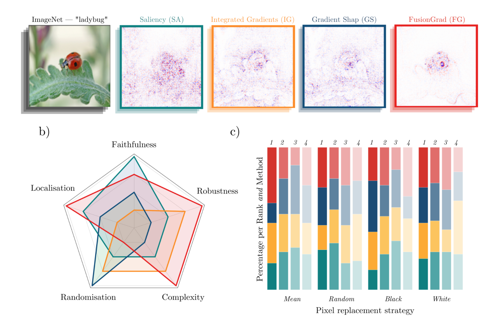
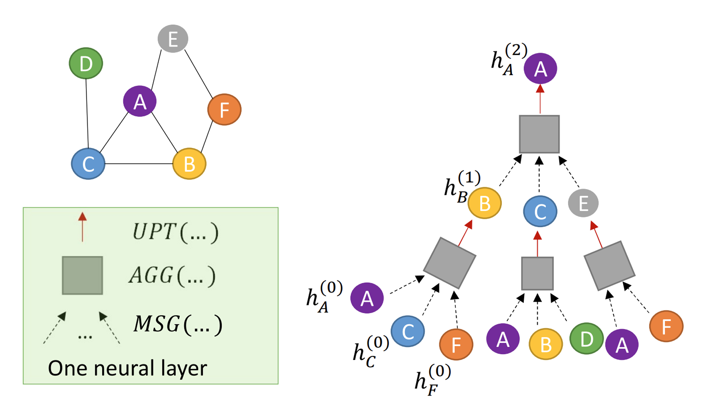
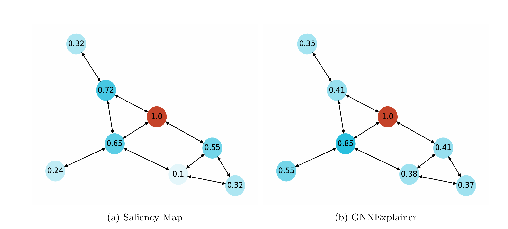
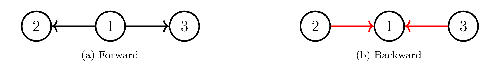
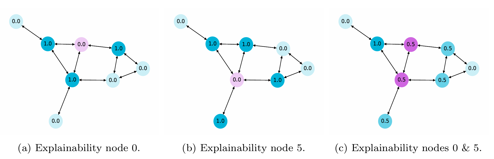
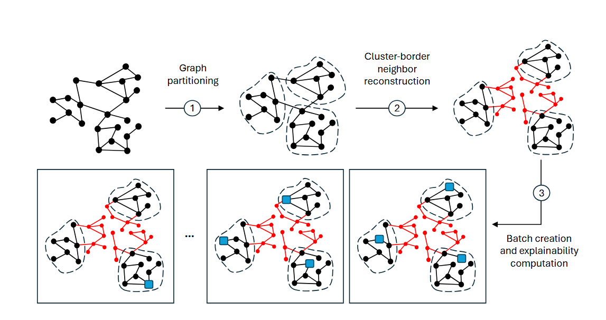
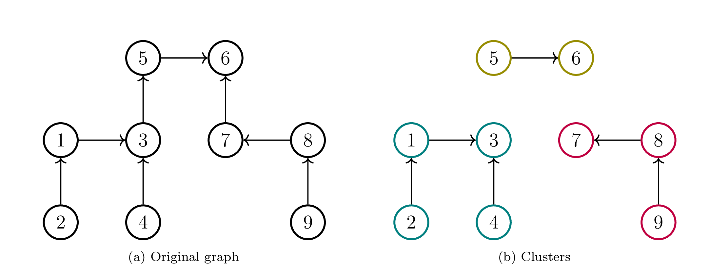
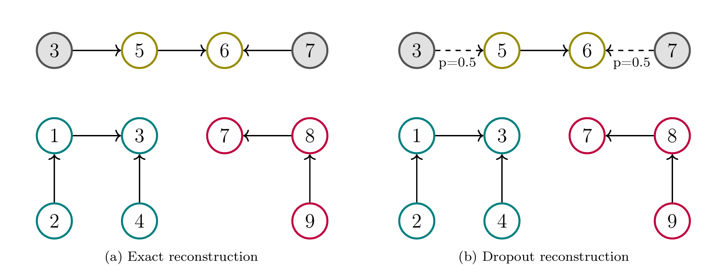
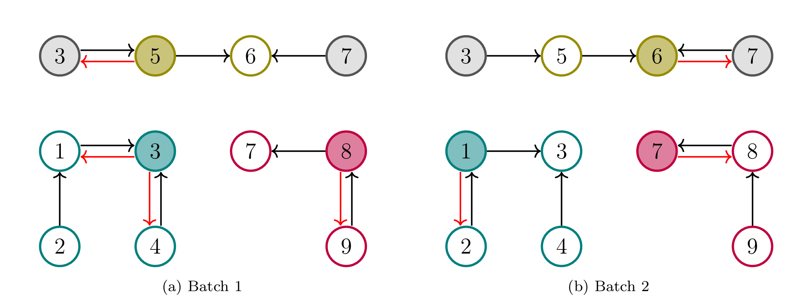
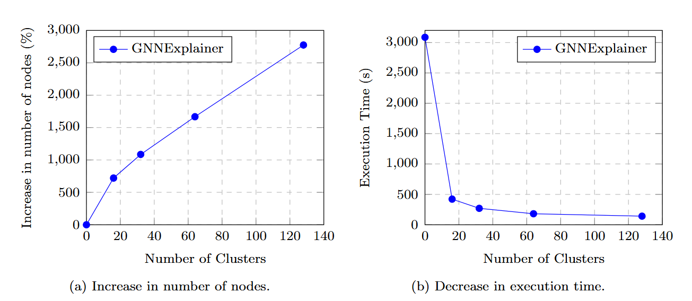

# Parallelizing Node-Level Explainability in Graph Neural Networks

#### Oscar Llorente Gonzalez (ollorente@comillas.edu)

---

## Explainability in Deep Learning

---

## What are Graph Neural Networks?

---

## Explainability in Graph Neural Networks

---

## What is Gradient Mixing?

If a node is a neighbor or two other nodes, in the backward gradient coming from those nodes will be averaged. If your explanation depends on it, then it is contaminated.

---

## Why XAI in a GNN cannot be parallelized?

---

## Proposed Methodology

The proposed methodology to avoid XAI contamination has the following steps:
- Graph partitioning.
- Reconstruction of broken cluster-border neighbors.
- Batch creation and explainability computation.

---

## Graph Partitioning

---

## Border Reconstruction

---

## Batch Explainability

---

## Results

